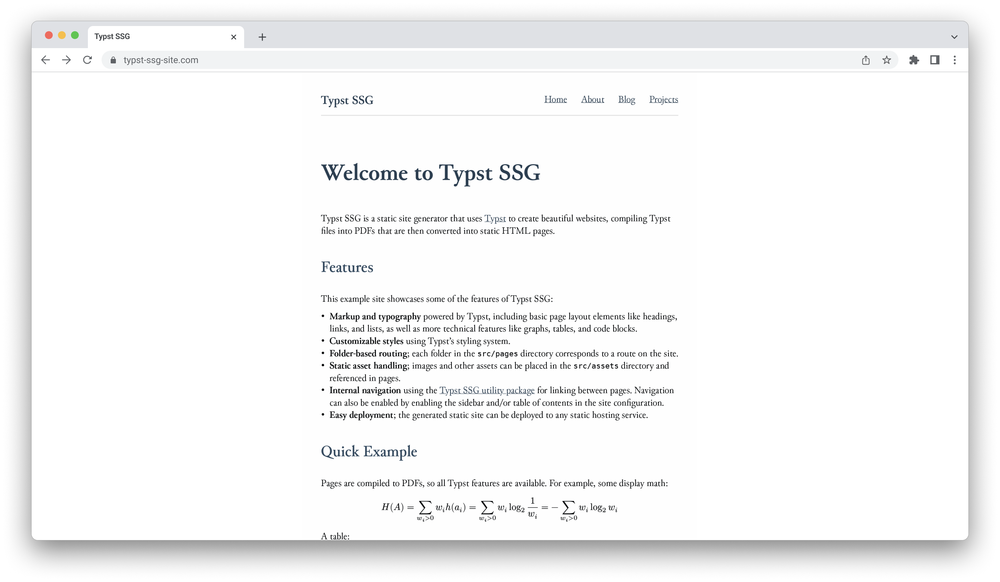

# Typst SSG

A static site generator that compiles [Typst](https://typst.app) documents to PDF and renders them in a browser viewer. Pages are written in Typst markup, compiled to PDF, then displayed in the DOM using a PDFium-based viewer.

- **[Main Repository](https://github.com/k0src/Typst-SSG)**
- [npm Package Repository](https://github.com/k0src/Typst-SSG-Package)
- [Typst Package Repository](https://github.com/k0src/Typst-SSG-Util-Package)



## Live Demo

A live demo on the example site can be found [here](https://k0src.github.io/Typst-SSG/).

## Quick Start

### Prerequisites

- **Node.js** ([download](https://nodejs.org))
- **Typst** ([install](https://github.com/typst/typst#installation))

### Installation

Install the npm package:

```bash
npm install typst-ssg
```

### Create a New Site

```bash
tssg init my-site
cd my-site
npm install
```

### Development

```bash
npm run dev
```

### Build for Production

```bash
npm run build
```

## Project Structure

**Example structure:**

```
project/
├── src/
│   ├── pages/                # Pages content (required)
│   │   ├── index.typ         # Root layout
│   │   ├── home.typ          # Home page
│   │   └── blog/
│   │       ├── index.typ     # Blog layout
│   │       └── post.typ      # Blog post page
│   ├── components/           # Reusable components
│   │   └── card.typ
│   └── assets/               # Assets (images, etc.). Favicons go here
│       └── image.jpg
├── build/                    # Generated build output
├── tssg.config.js            # Config file
└── package.json
```

### Pages Folder

The `pages/` folder is required. This defines the routing structure of the site.

- `pages/home.typ` → `/` (if set as indexPage)
- `pages/about.typ` → `/about/`
- `pages/blog/post.typ` → `/blog/post/`

`index.typ` files with a `#let layout(body) = { ... }` function define layout styles for pages contained in that folder. Other `.typ` files are rendered as pages.

Create `tssg.config.js` in your project root:

```javascript
export default {
  // Source directory (default: "./src")
  src: "./src",

  // Output directory (default: "./build")
  output: "./build",

  // Base path for deployment (default: "/")
  // For GitHub Pages project sites, use "/repo-name/"
  // For user/org sites or custom domains, use "/"
  base: "/",

  // Which page maps to root route "/" (default: "index.typ")
  indexPage: "index.typ",

  // Layout inheritance: "none" | "fallback" | "merge" (default: "fallback")
  // - none: Pages only use same-directory layout
  // - fallback: Pages use nearest parent layout
  // - merge: Pages merge all ancestor layouts' set statements
  layoutInheritance: "fallback",

  // Maximum layout merge depth (default: 5)
  maxMergeDepth: 5,

  // PDF rendering quality multiplier (default: 2.0)
  // Higher = better quality but larger files and slower rendering
  pdfQuality: 2.0,

  // Sidebar configuration
  sidebar: {
    // Enable/disable sidebar globally (default: true)
    enabled: true,
  },

  // Table of contents configuration
  toc: {
    // Enable/disable TOC globally (default: true)
    enabled: true,

    // Minimum heading level to include (default: 1)
    // 1 = top-level headings only, 2 = second-level, etc.
    minLevel: 1,

    // Maximum heading level to include (default: 4)
    maxLevel: 4,
  },

  // Theme configuration for sidebar and TOC
  theme: {
    // Sidebar styling
    sidebarBg: "#f8f9fa", // Background color
    sidebarTextColor: "#333", // Text color
    sidebarActiveColor: "#007bff", // Active page highlight color

    // TOC styling
    tocBg: "#f8f9fa", // Background color
    tocTextColor: "#333", // Text color
  },
};
```

### Per-Page Configuration

You can also configure sidebar and TOC on individual pages using the `page-config()` function:

```typst
#import "@local/tssg-util:0.1.0": page-config

// Disable sidebar and TOC on this page
#page-config(sidebar: false, toc: false)

// Or customize TOC levels for this page
#page-config(toc-min-level: 2, toc-max-level: 3)
```

## Examples

See the `example/` folder for a complete example site using Typst SSG.

## Contributing

Contributions are welcome. Please open issues and pull requests for the npm package in the [npm Package Repository](https://github.com/k0src/Typst-SSG-Package) and open issues and pull requests for the Typst utility package in the [Typst Package Repository](https://github.com/k0src/Typst-SSG-Util-Package).

## License

[MIT](LICENSE)
